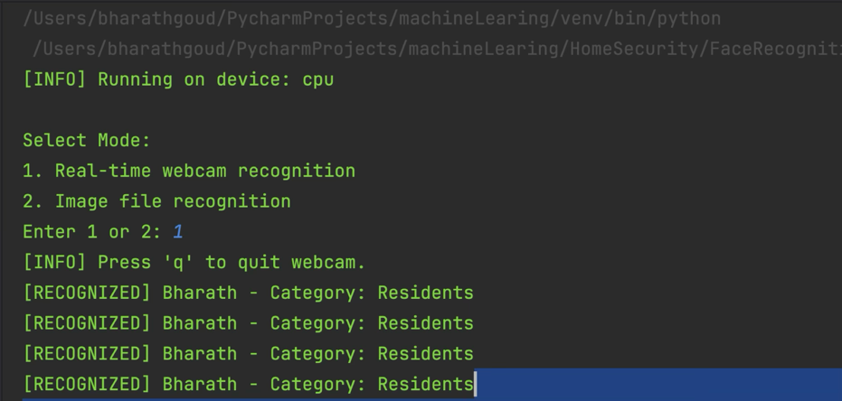
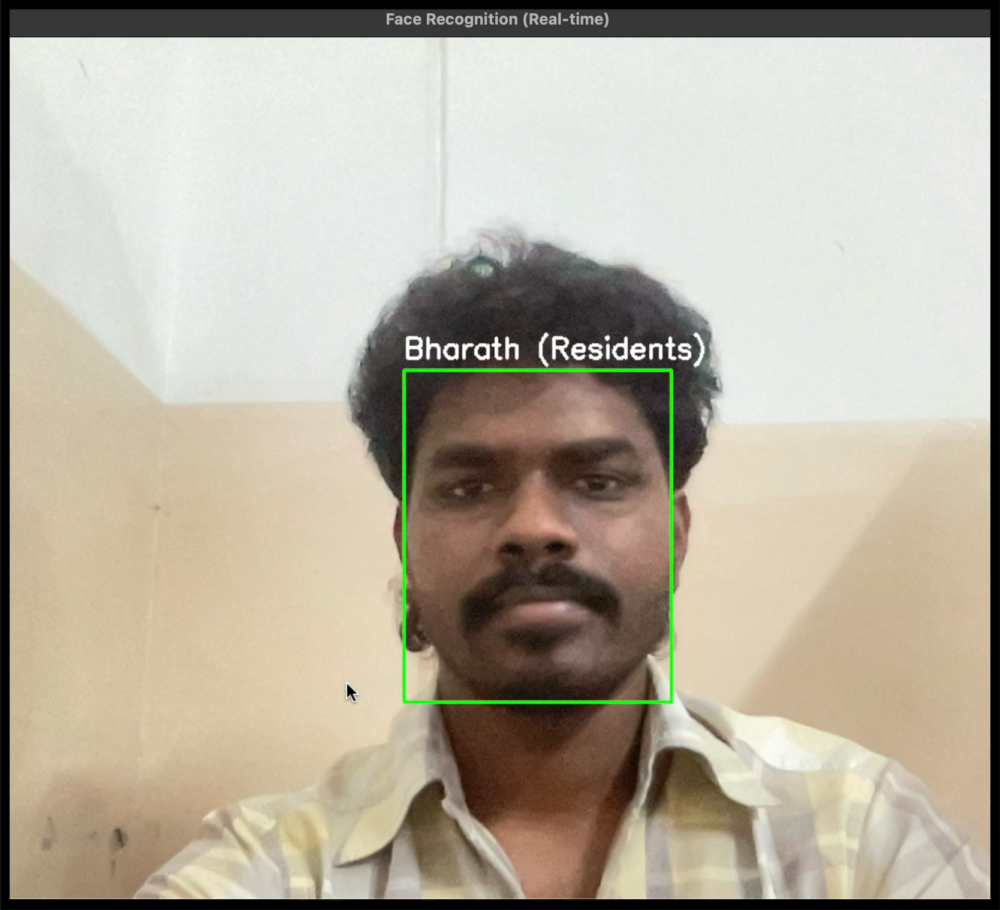
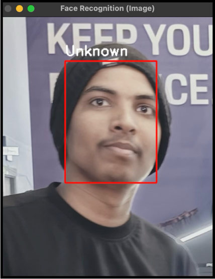
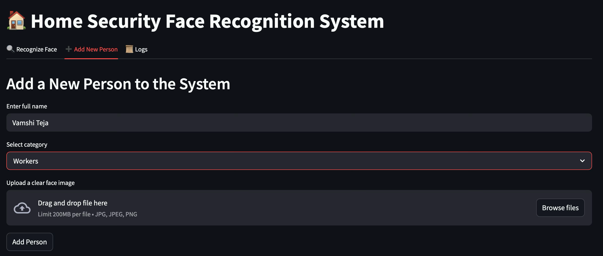

# 🏠 Intelligent Home Security System

An AI-powered home security system that enhances safety by recognizing known individuals, flagging unknown persons, detecting weapons, monitoring for falls, and identifying dangerous animals — all in **real-time** with instant **Telegram alerts**.

---

## 🚀 Features

* **👤 Face Recognition**  

  Identifies and categorizes people as **Residents**, **Workers**, or **Relatives**. Unknown individuals are flagged immediately.

    


     

--- 

    

    

---  

 * **Interface**  
  

---
* **🔫 Weapon Detection**  

  Automatically scans for weapons (guns, knives, etc.) when an unknown person is detected.  

    
  
---  

    

 --- 


* **🧓 Fall Detection**  

  Monitors for falls, particularly for children and elderly residents.

* **🐍 Dangerous Animal Detection**  

  Detects threats like snakes and other dangerous animals.

* **📲 Real-time Notifications**  

  Sends instant alerts to the homeowner via **Telegram** for critical events.

* **💻 User-Friendly Interface**  

  Manage the system via an interactive **Streamlit** dashboard — add new individuals, monitor live feeds, and view event logs.

---

## 🛠️ Technologies Used

### Face Detection & Recognition

* **MTCNN** – High-accuracy face detection and alignment.
* **InceptionResnetV1** – Deep learning model for facial embedding and recognition.

### Weapon & Threat Detection

* **Google Gemini API** – Advanced image analysis for weapon identification.

### User Interface

* **Streamlit** – Lightweight and interactive web application framework.

### Notifications

* **Telegram Bot API** – Sends alerts with images and details in real-time.

### Core Language

* **Python**

---

## ⚙️ System Architecture

**1. Face Recognition Module**

* Captures live video or processes uploaded images.
* **MTCNN** detects and crops faces.
* **InceptionResnetV1** extracts facial embeddings.
* Embeddings are compared with a local database.
* Unknown individuals trigger an **alert**.

**2. Weapon Detection Module**

* Activated when an **Unknown** person is detected.
* Scene snapshot sent to **Google Gemini API**.
* If a weapon is found → **High-priority alert sent**.

**3. Notification Module**

* Uses **Telegram Bot** for messaging.
* Sends alerts with **event details + images**.

**4. User Interface (Streamlit)**

* **Recognize Face** – Live/video-based recognition.
* **Add New Person** – Enroll residents, workers, and relatives.
* **Logs** – View history of alerts.

---

## 📦 Setup & Installation

1. **Clone the repository**

   ```bash
   git clone https://github.com/your-username/home-security-system.git
   cd home-security-system
   ```

2. **Create a virtual environment & install dependencies**

   ```bash
   python -m venv venv
   source venv/bin/activate      # On Windows: venv\Scripts\activate
   pip install -r requirements.txt
   ```

3. **Set up environment variables**

   * Create a `.env` file in the project root.
   * Add your credentials:

     ```env
     GOOGLE_API_KEY="YOUR_GEMINI_API_KEY"
     TELEGRAM_BOT_TOKEN="YOUR_TELEGRAM_BOT_TOKEN"
     TELEGRAM_CHAT_ID="YOUR_TELEGRAM_CHAT_ID"
     ```

4. **Run the Streamlit app**

   ```bash
   streamlit run app.py
   ```

---

## 📖 Usage

1. Open the Streamlit interface (usually at **[http://localhost:8501](http://localhost:8501)**).
2. In **Add New Person**, register residents, workers, and relatives.
3. In **Recognize Face**, start live detection or upload images.
4. Check **Telegram** for instant alerts on unknown persons, weapons, falls, or dangerous animals.

